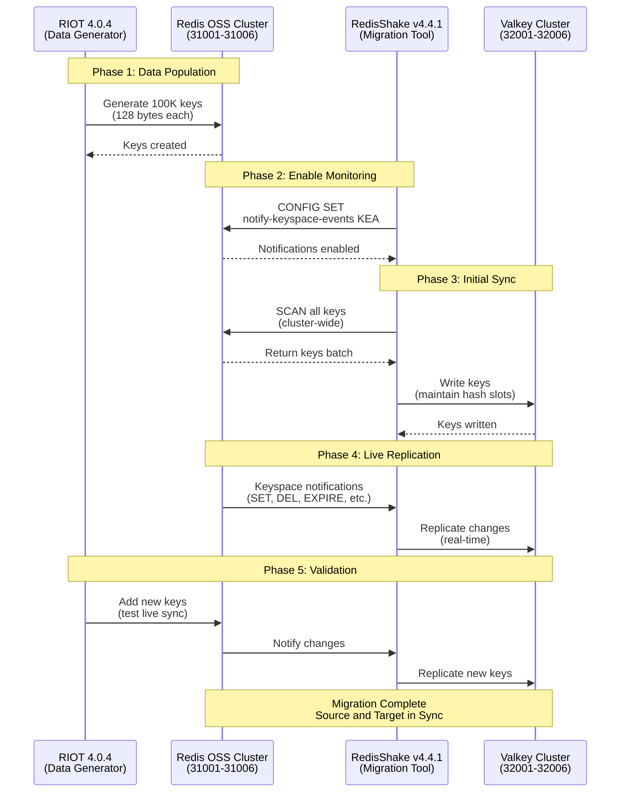

# RedisShake Live Migration Demo

This project demonstrates live data migration from Redis OSS 7.2.4 to Valkey 9.0.0 using RedisShake v4.4.1. The demo runs entirely with native binaries on macOS ARM64 - no Docker or containers required.

## What This Demo Does

The demo sets up two separate clusters and migrates data between them:

- **Source**: Redis OSS 7.2.4 cluster (6 nodes on ports 31001-31006)
- **Target**: Valkey 9.0.0 cluster (6 nodes on ports 32001-32006)
- **Migration Tool**: RedisShake v4.4.1 (cluster-to-cluster sync)
- **Data Generator**: RIOT 4.0.4 (generates 100K test keys)

RedisShake performs a full scan of the Redis cluster and replicates all keys to the Valkey cluster, enabling zero-downtime migration.

## Prerequisites

- macOS with ARM64 (Apple Silicon) architecture
- Command-line tools: `wget`, `tar`, `unzip`
- Build tools: `make`, `gcc` (Xcode Command Line Tools)
- Disk space: ~500MB for source code and binaries

## Quick Start

Run the scripts in order:

```bash
# 1. Download all required binaries and source code
./01_download.sh

# 2. Compile Redis and Valkey from source
./02_compile.sh

# 3. Create both Redis and Valkey clusters
./03_create_clusters.sh

# 4. Validate cluster health (optional)
./04_validate_clusters.sh

# 5. Flush databases to start fresh (optional)
./05_flushdbs.sh

# 6. Populate Redis cluster with 100K test keys
./06_populate_source.sh

# 7. Run live migration from Redis to Valkey
./07_live_migration.sh

# 8. Update source with additional data (optional - tests live sync)
./08_update_soure.sh

# 9. Check database sizes on both clusters
./09_check_dbsize.sh

# 10. Sample random keys from both clusters
./10_random_keys.sh

# 11. Stop clusters and cleanup
./11_cleanup.sh
```

## How Live Migration Works

1. **Keyspace Notifications**: Enables `notify-keyspace-events KEA` on Redis to track changes
2. **Configuration**: Generates `redis-shake.toml` with cluster endpoints
3. **Scan Mode**: RedisShake scans all keys from Redis cluster using `SCAN` command
4. **Replication**: Writes all keys to Valkey cluster maintaining data integrity
5. **Verification**: Compares `DBSIZE` between source and target clusters

The migration is non-destructive - source data remains intact.

## Project Structure

```
.
├── config.sh                    # Environment variables and cluster configuration
├── 01_download.sh              # Downloads Redis, Valkey, RedisShake, RIOT
├── 02_compile.sh               # Compiles Redis and Valkey with TLS support
├── 03_create_clusters.sh       # Creates 6-node clusters for both systems
├── 04_validate_clusters.sh     # Validates cluster health
├── 05_flushdbs.sh              # Flushes all databases
├── 06_populate_source.sh       # Generates 100K keys using RIOT
├── 07_live_migration.sh        # Runs RedisShake migration
├── 08_update_soure.sh          # Adds more data to test live sync
├── 09_check_dbsize.sh          # Compares database sizes
├── 10_random_keys.sh           # Samples random keys from both clusters
├── 11_cleanup.sh               # Stops clusters and cleans up
└── redis-shake.toml            # Generated RedisShake configuration
```

## Configuration Details

All configuration is centralized in `config.sh`:

- **Redis Cluster**: `localhost:31001-31006`
- **Valkey Cluster**: `localhost:32001-32006`
- **RESP Protocol**: RESP3
- **Test Data**: 100K STRING keys, 128 bytes each

## Architecture Diagrams

### Cluster Topology

This diagram shows the structure of both the Redis OSS source cluster and the Valkey target cluster:

```mermaid
graph TB
    subgraph "Redis OSS 7.2.4 Cluster (Source)"
        R1["Primary 1<br/>Port 31001<br/>Slots: 0-5460"]
        R2["Primary 2<br/>Port 31002<br/>Slots: 5461-10922"]
        R3["Primary 3<br/>Port 31003<br/>Slots: 10923-16383"]
        R4["Replica 1<br/>Port 31004"]
        R5["Replica 2<br/>Port 31005"]
        R6["Replica 3<br/>Port 31006"]
        
        R4 -.->|replicates| R1
        R5 -.->|replicates| R2
        R6 -.->|replicates| R3
    end
    
    subgraph "Valkey 9.0.0 Cluster (Target)"
        V1["Primary 1<br/>Port 32001<br/>Slots: 0-5460"]
        V2["Primary 2<br/>Port 32002<br/>Slots: 5461-10922"]
        V3["Primary 3<br/>Port 32003<br/>Slots: 10923-16383"]
        V4["Replica 1<br/>Port 32004"]
        V5["Replica 2<br/>Port 32005"]
        V6["Replica 3<br/>Port 32006"]
        
        V4 -.->|replicates| V1
        V5 -.->|replicates| V2
        V6 -.->|replicates| V3
    end
    
    style R1 fill:#6983FF
    style R2 fill:#6983FF
    style R3 fill:#6983FF
    style R4 fill:#1A2026
    style R5 fill:#1A2026
    style R6 fill:#1A2026
    
    style V1 fill:#642637
    style V2 fill:#642637
    style V3 fill:#642637
    style V4 fill:#E0A2AF
    style V5 fill:#E0A2AF
    style V6 fill:#E0A2AF
```



### Migration Strategy

This diagram illustrates how RedisShake performs the live migration between clusters:



### Data Flow Details

```mermaid
flowchart LR
    subgraph "Source Cluster"
        A[Redis Primary 1<br/>31001] 
        B[Redis Primary 2<br/>31002]
        C[Redis Primary 3<br/>31003]
    end
    
    subgraph "RedisShake Process"
        D[Scanner<br/>SCAN command]
        E[Event Listener<br/>Keyspace notifications]
        F[Writer<br/>Cluster-aware]
    end
    
    subgraph "Target Cluster"
        G[Valkey Primary 1<br/>32001]
        H[Valkey Primary 2<br/>32002]
        I[Valkey Primary 3<br/>32003]
    end
    
    A -->|Initial scan| D
    B -->|Initial scan| D
    C -->|Initial scan| D
    
    A -.->|Live changes| E
    B -.->|Live changes| E
    C -.->|Live changes| E
    
    D --> F
    E --> F
    
    F -->|Hash slot routing| G
    F -->|Hash slot routing| H
    F -->|Hash slot routing| I
    
    style D fill:#30176E
    style E fill:#30176E
    style F fill:#30176E
    
    style A fill:#6983FF
    style B fill:#6983FF
    style C fill:#6983FF
    
    style G fill:#642637
    style H fill:#642637
    style I fill:#642637
```



## Troubleshooting

**Clusters won't start**: Check if ports 31001-31006 or 32001-32006 are already in use
```bash
lsof -i :31001
```

**Compilation fails**: Ensure Xcode Command Line Tools are installed
```bash
xcode-select --install
```

**Migration incomplete**: Verify keyspace notifications are enabled
```bash
valkey-cli -p 31001 CONFIG GET notify-keyspace-events
```

**Permission denied**: Make scripts executable
```bash
chmod +x *.sh
```

## Cleanup

To stop all clusters and remove temporary data:

```bash
./11_cleanup.sh
```

This stops all Redis and Valkey processes and removes cluster data directories.

## References

- [RedisShake Documentation](https://github.com/tair-opensource/RedisShake)
- [Valkey Documentation](https://valkey.io/)
- [Redis Cluster Tutorial](https://redis.io/docs/management/scaling/)
- [RIOT - Redis Input/Output Tools](https://github.com/redis/riot)